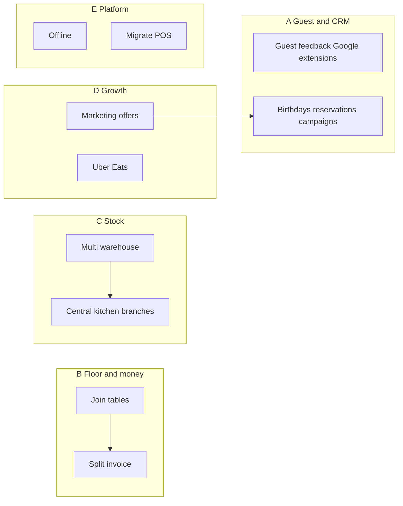

# GitHub #52 — dedicated issues & plan

**Parent:** [#52 — Various topics to enhance](https://github.com/tanjunnan0101/pos/issues/52)

The umbrella issue listed many themes. This document **plans** them as **separate GitHub issues** with suggested **order**, **dependencies**, and **ready-to-paste** titles and bodies.

**Filing on GitHub:** If `gh issue create` fails with a token/permissions error, file each block below as a new issue (or run `gh` after `gh auth refresh` with `repo` scope and org access). After filing, paste the new issue numbers into a comment on #52 and update [0032-github-issues-roadmap.md](0032-github-issues-roadmap.md).

---

## Suggested phases (not strict sprints)

| Phase | Themes | Rationale |
|-------|--------|-----------|
| **A — Guest & CRM** | Surveys/Google extensions, birthdays | Builds on existing guest feedback, billing CRM, ties to [#54](https://github.com/tanjunnan0101/pos/issues/54). |
| **B — Floor & money** | Join tables, split invoice | High daily value for restaurants; touches orders, payments, printing. |
| **C — Stock & supply** | Multi-warehouse, central kitchen → branches | Inventory and fulfillment model; larger schema + UX. |
| **D — Growth & channels** | Marketing/promos, Uber Eats | Pricing engine + external APIs; compliance and ops overhead. |
| **E — Platform** | Offline client, migration from other POS | Architecture and one-off tooling; long horizon. |



---

## Issue 1 — Multi-warehouse inventory (“almacenes”)

**Title:** `feat: Multi-warehouse inventory (almacenes / cold room, etc.)`

**Body:**

```markdown
## Summary
Support **multiple stock locations** per tenant (e.g. main kitchen, cold room, bar) so stock moves and purchasing can be tied to a **warehouse**, not only a global SKU count.

## Context
Tracked under umbrella [#52](https://github.com/tanjunnan0101/pos/issues/52). Current inventory is purchase-oriented without per-location semantics.

## Scope (proposal)
- Data model: `Warehouse` (tenant-scoped), optional `warehouse_id` on stock-related entities / moves.
- UX: choose warehouse on receive/adjust; stock dashboard by location.
- Non-goals (initial slice): full WMS picking, barcode multi-bin.

## Docs
- Roadmap: `docs/0032-github-issues-roadmap.md`

## Acceptance criteria (MVP)
- [ ] Staff can define ≥1 warehouse per tenant.
- [ ] Stock quantity (or moves) attributable to a warehouse for at least one existing inventory flow.
- [ ] Migrations + tests; documented in `CHANGELOG.md`.
```

---

## Issue 2 — Split invoice / split bill

**Title:** `feat: Split bill / partial payments (multi-party, HitPay, Tax invoice)`

**Body:**

```markdown
## Summary
Allow **splitting** an order bill: partial payments, multiple payers, or separate tickets while preserving audit trail.

## Context
[#52](https://github.com/tanjunnan0101/pos/issues/52). Touches `Order`, HitPay payment requests, staff **Mark as paid**, and **Print tax invoice** (`docs/0017-billing-customers-factura.md`).

## Scope (proposal)
- Model: payment allocations or sub-orders; define whether split is **by line**, **by amount**, or **by guest session**.
- HitPay: multiple intents or partial capture strategy (product decision).
- Tax invoice: one invoice per payer vs. single invoice with split notation (legal review).

## Dependencies
- May interact with **join tables** (single party, merged tables) — align UX early.

## Acceptance criteria (MVP)
- [ ] Documented split model (data + API).
- [ ] At least one end-to-end path: staff records two payments for one order OR customer pays partial.
- [ ] No silent double-charge; reconciliation fields for reporting.
```

---

## Issue 3 — Join tables (floor + session)

**Title:** `feat: Join tables on floor plan (merged covers, billing options)`

**Body:**

```markdown
## Summary
When guests **combine physical tables**, staff can **join** them in the POS: shared or separate bills, correct capacity for reservations/walk-ins.

## Context
[#52](https://github.com/tanjunnan0101/pos/issues/52). Per-table **session_id** for customer menu already exists — see `docs/0008-order-management-logic.md`.

## Scope (proposal)
- Floor UI: select tables → “Join group” / “Unjoin”.
- Backend: table group id, rules for **one active order** vs. **multiple sessions** on merged tables.
- Reservations: optional link to table group for party size.

## Dependencies
- Coordinate with **split invoice** if merged tables sometimes split payment.

## Acceptance criteria (MVP)
- [ ] Staff can create and clear a join group from `/tables` (or canvas).
- [ ] Orders and/or reservations respect joined capacity without double-booking the same table twice.
- [ ] Documented behaviour for customer menu QR (which token / redirect).
```

---

## Issue 4 — Offline-capable POS client

**Title:** `feat: Offline operation (queued orders, sync, conflict handling)`

**Body:**

```markdown
## Summary
Allow **critical flows** (e.g. take order, cash payment) to work with **intermittent connectivity**, then **sync** to the server.

## Context
[#52](https://github.com/tanjunnan0101/pos/issues/52). Large architecture: service worker, local persistence, idempotent APIs, conflict resolution.

## Scope (proposal)
- Phase 0: spike — which surfaces (staff-only vs. customer menu) and offline duration targets.
- Phase 1: read-only cache of menu/products; Phase 2: write queue with retry.

## Risks
- Double submission, clock skew, HitPay when offline (likely **cash-only** offline).

## Acceptance criteria (MVP)
- [ ] Written **architecture ADR** + threat model (duplicates, fraud).
- [ ] Prototype: one staff action offline → syncs cleanly online.
```

---

## Issue 5 — Migrate from existing POS / system

**Title:** `feat: Import / migration from external POS (CSV/API, runbook)`

**Body:**

```markdown
## Summary
Provide a **repeatable path** to import products, tables, customers, and optionally historical orders from **another system**.

## Context
[#52](https://github.com/tanjunnan0101/pos/issues/52). Today: seeds and specialized imports exist; no generic migration toolkit or **cutover runbook**.

## Scope (proposal)
- Mapping templates (CSV columns → our models).
- Idempotent import CLI or admin UI; dry-run + validation report.
- `docs/` runbook: pre-cutover, execution, rollback, smoke tests.

## Acceptance criteria (MVP)
- [ ] One documented “happy path” import (e.g. products + categories) with sample CSV.
- [ ] Validation errors surfaced without corrupting tenant data.
```

---

## Issue 6 — Guest feedback & Google presence (extensions)

**Title:** `feat: Extend guest feedback & Google review journey (#52 / #54)`

**Body:**

```markdown
## Summary
**Extend** the existing guest feedback flow and Google deep-links; remaining work from [#52](https://github.com/tanjunnan0101/pos/issues/52) after MVP shipped.

## Already shipped (baseline)
- `/feedback/:tenantId`, star rating, optional comment/contact.
- Tenant **Google review URL** + optional **Google Maps** link on public pages (see `CHANGELOG.md`, [#54](https://github.com/tanjunnan0101/pos/issues/54)).

## Possible extensions
- NPS / short survey templates; optional post-reservation email/SMS link.
- QR on receipt; staff dashboard aggregates (trends, export).
- **Note:** Google does not allow posting reviews via API — links only.

## Acceptance criteria
- [ ] Prioritized backlog of extensions with **one** vertical implemented per release.
```

---

## Issue 7 — Birthdays & occasions (reservations + automation)

**Title:** `feat: Birthdays on reservations + optional marketing triggers (#52 / #54)`

**Body:**

```markdown
## Summary
Capture **birthdays** for **guests** (e.g. on reservations), not only billing customers; optional **reminders** or campaigns.

## Context
[#52](https://github.com/tanjunnan0101/pos/issues/52). **Done:** optional `birth_date` on **billing customers** (Tax invoice CRM). **Open:** reservation guest profile, consent, automation → overlaps [#54](https://github.com/tanjunnan0101/pos/issues/54).

## Scope (proposal)
- Optional `birth_date` (or month/day only) on reservation or linked guest record.
- Settings: enable/disable marketing use; consent text (GDPR).
- Future: tie to email/SMS in #54.

## Acceptance criteria (MVP)
- [ ] Staff or guest can set birthday on at least one flow (reservation create/edit or public book).
- [ ] Data visible in staff UI; export optional.
- [ ] No automated outbound messages until #54 consent/provider work exists (or stub behind feature flag).
```

---

## Issue 8 — Marketing & special offers

**Title:** `feat: Promotions & special offers (pricing rules, eligibility)`

**Body:**

```markdown
## Summary
**Promotions engine**: happy hour, %-off categories, BOGO-lite, or coupon codes with eligibility (time window, tenant, channel).

## Context
[#52](https://github.com/tanjunnan0101/pos/issues/52). Overlaps [#54](https://github.com/tanjunnan0101/pos/issues/54) (comms) but this issue is **pricing + cart application**.

## Scope (proposal)
- Rule types MVP; stackability policy; audit on order lines (snapshot discount).
- Staff UI to create/enable promos; customer menu reflects eligible prices.

## Dependencies
- Tax-inclusive pricing: clarify how discounts affect tax lines (`docs` tax system).

## Acceptance criteria (MVP)
- [ ] At least one promo type live with tests and `CHANGELOG` entry.
```

---

## Issue 9 — Central kitchen → branches

**Title:** `feat: Central kitchen supplying branches (multi-site fulfillment)`

**Body:**

```markdown
## Summary
One **production kitchen** fulfils items for **multiple branches** (sucursales): transfer, visibility, and billing between sites.

## Context
[#52](https://github.com/tanjunnan0101/pos/issues/52). Not in current schema; likely multi-tenant or multi-site flags, transfer orders.

## Scope (proposal)
- Phase 0: domain model workshop (same tenant vs. linked tenants).
- Phase 1: internal transfer / “fulfil at hub” flag on order or order items.

## Dependencies
- **Multi-warehouse** may share some location concepts — align design.

## Acceptance criteria (MVP)
- [ ] ADR choosing multi-tenant vs. single-tenant multi-site.
- [ ] Smallest slice: e.g. branch sees “prepared at HQ” state or transfer record.
```

---

## Issue 10 — Uber Eats (and similar) integration

**Title:** `feat: Third-party delivery menu sync & orders (Uber Eats, etc.)`

**Body:**

```markdown
## Summary
Interface to **aggregators** (Uber Eats, …): menu sync, order ingestion, status callbacks (within API constraints).

## Context
[#52](https://github.com/tanjunnan0101/pos/issues/52). See `docs/0031-order-customizations-plan.md` (delivery integrations).

## Scope (proposal)
- Phase 0: vendor API review + sandbox credentials pattern (env, secrets).
- Phase 1: one direction (e.g. import orders as POS orders) OR menu export only.

## Risks
- Menu parity with customizations (#50); 429/webhooks; operational support.

## Acceptance criteria (MVP)
- [ ] Documented integration scope + env vars in `README` / `docs`.
- [ ] One sandbox-validated flow (even menu-only) with tests or scripted smoke check.
```

---

## After filing

1. Comment on **#52** with: `Split into: #… #…` (all new numbers).
2. Update **Status** column in [0032-github-issues-roadmap.md](0032-github-issues-roadmap.md) to link each row to its issue (replace “Not started” row text with `Issue #NNN`).
3. Close **#52** when the team agrees the umbrella is fully superseded by children (optional).
