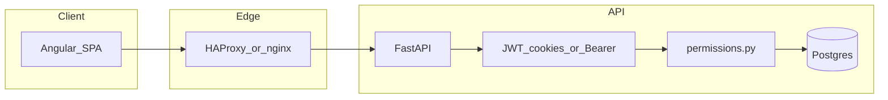

# Security review (POS2)

This document records a structured security pass aligned with the project security plan: uploads exposure, authentication, tenant isolation (IDOR), public and payment surfaces, injection/SSRF, operations, and dependencies. **It is not a penetration test**; repeat after major releases.

## Architecture (auth and tenant boundary)



- **Sessions:** Short-lived JWT in `HttpOnly` cookie `access_token`; refresh in `refresh_token` with separate `REFRESH_SECRET_KEY`. `PRODUCTION=true` sets `secure` cookies (`back/app/main.py`).
- **Revocation:** `User.token_version` must match JWT claim (`back/app/security.py`).
- **RBAC:** `require_permission` / `require_role` on mutating routes (`back/app/permissions.py`).

## 1. Uploads and static files (fixed)

### Finding (remediated)

The app mounted `StaticFiles` on `/uploads` over the entire `uploads/` tree. Staff contract PDFs are stored under `uploads/{tenant_id}/contracts/`. Explicit routes existed only for `logo`, `header`, `products`, and `providers/.../products`, so **`GET /uploads/{tenant_id}/contracts/{filename}` was served publicly** without authentication.

### Remediation

- Added **`GET /uploads/{tenant_id}/contracts/{filename}`** handler that always returns **403**, registered **before** the `StaticFiles` mount (`back/app/main.py`).
- **Regression test:** `back/tests/test_uploads_security.py`.

### Residual notes

- **`/uploads/providers/{token}/...`:** Non-`products` paths could still be served by `StaticFiles` if files were placed there. Provider `token` is a UUID (`models.Provider`). Prefer keeping only `products/` under each token directory.
- **Path traversal:** Filename parameters on explicit routes reject `/`, `\`, and leading `.`. Rely on Starlette `StaticFiles` path normalization for the mount (avoid placing symlinks under `uploads/` in production).

## 2. Authentication and session security

| Topic | Assessment |
|--------|------------|
| JWT algorithm | HS256 from settings; no `alg=none` path. |
| Cookie flags | `httponly=True`, `samesite=lax`, `secure` when `PRODUCTION`. |
| CSRF | Same-origin SPA + `SameSite=Lax` reduces cross-site cookie use on POST from third-party sites. For future cross-site embeds, evaluate CSRF tokens or `SameSite=strict` for sensitive mutations. |
| `/users/me` | Uses `get_current_user_optional` — returns `null` for anonymous (no credential leak). |
| `/ws-token` | Returns bearer token for WebSocket upgrade; same-origin + CORS limits cross-site reads of the response body. |
| Password reset | Raw token hashed (SHA-256) in DB; generic API messages to reduce enumeration; rate limits on reset endpoints (`back/app/main.py`). |
| OTP | `otp_pending` JWT type; TOTP verify with window 1. |
| Refresh token | **No rotation:** same refresh JWT valid until expiry; compromise window is `REFRESH_TOKEN_EXPIRE_DAYS`. Consider refresh rotation + reuse detection for higher assurance. |

## 3. Multi-tenant IDOR (sampled)

- **Pattern:** Order mutations consistently filter `Order.tenant_id == current_user.tenant_id` (e.g. `DELETE /orders/{order_id}` in `main.py`).
- **Regression test:** `back/tests/test_security_tenant_idor_orders.py` — tenant A cannot delete tenant B’s order (expects 404).
- **Recommendation:** When adding endpoints with resource IDs, always join or filter on `tenant_id` (or provider scope) in the same query that loads the resource; spot-check `get_current_user_optional` paths (e.g. public reservation create) for tenant_id validation.

## 4. Public surfaces, payments, abuse

| Area | Notes |
|------|--------|
| Table PIN / menu | Documented in `docs/0009-table-pin-security.md`. Table token is unique; PIN is 4-digit — rate-limit menu/order endpoints in production (`RATE_LIMIT_*`). |
| HitPay | **No inbound payment webhooks** in-repo for HitPay; confirmation uses `PaymentIntent.retrieve` / HitPay API with **tenant-scoped secret** and checks metadata amount/order (`main.py`). Table-bound public flows require `table_token` + matching `order_id`. |
| Rate limiting | `slowapi` + Redis; client IP from **first** `X-Forwarded-For` hop — **trust only when the edge proxy strips/spoof-proof headers** (see HAProxy config). |
| Reservation delay notice | Extra Redis counter per IP + reservation id. |

## 5. Injection, SSRF, file handling

- **SQL:** Prefer SQLModel/ORM; migrations use raw SQL (offline). Grep for ad-hoc `text(` when changing data access.
- **HTML / print:** Staff contract merge escapes placeholder values with `html.escape` (`staff_contract_template_merge.py`). Template HTML is trusted admin content.
- **Uploads:** Image routes validate type/size; contract PDF max size enforced in `staff_contract_routes.py`.
- **SSRF:** Review any new feature that fetches user-supplied URLs server-side (allowlist + timeout).

## 6. Secrets, config, logging

- **Never commit** real `config.env`. Production must override `SECRET_KEY`, `REFRESH_SECRET_KEY`, DB password, payment secrets (`config.env.example` documents variables).
- **Logging:** Avoid logging full request bodies, passwords, or tokens; follow existing log patterns.
- **Edge:** Terminate TLS at proxy; align `CORS_ORIGINS` with real front-end origins in production.

## 7. Dependencies (snapshot)

Commands (run periodically, e.g. before release):

```bash
# Frontend (from repo root)
cd front && npm audit

# Backend (venv or CI image with write access to install tools)
pip install pip-audit && pip-audit -r back/requirements.txt
```

**Frontend (`npm audit`, Mar 2026 snapshot):** Reported issues included **@angular/ssr** (SSRF/header injection/open redirect advisories — relevant if SSR request path is enabled in deployment), **qs** DoS advisory, and transitive Angular advisories. **Assess impact** for your deployment (dev often uses client-only `ng serve`; production Docker should match how SSR is used). Track upgrades via pinned Angular minors per team policy (`npm ci`, no blind `audit fix --force` without testing).

**Backend:** `pip-audit` could not be run inside the default `back` container as non-root without a writable install path; run in CI or a local venv.

## Related docs and rules

- `docs/0009-table-pin-security.md`
- `.cursor/rules/security-secrets-tenant.mdc`
- `AGENTS.md` (secrets, tenant boundaries)

## Change log

| Date | Action |
|------|--------|
| 2026-03-26 | Blocked public `/uploads/.../contracts/...`; added tests; initial `SECURITY-REVIEW.md`. |
